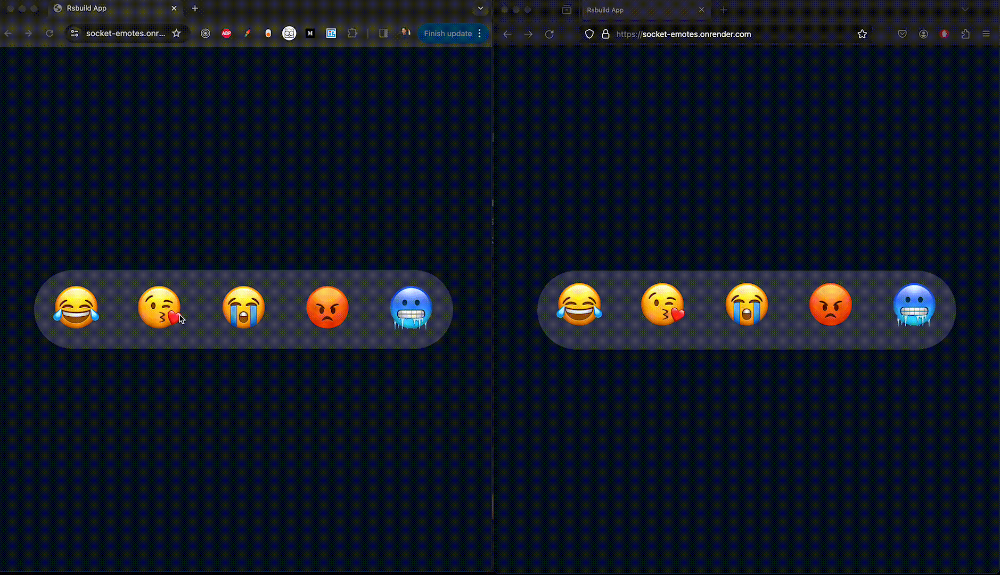

## Socket Emotes ⚡️

Live reactions built using React and uses WebSockets to broadcast reactions to clients.

[socket-emotes.onrender.com](https://socket-emotes.onrender.com)

- **Real-time emoji reactions:** Select from a range of emojis to express reactions instantly.
- **Web socket integration:** Web sockets to enable real-time broadcasting of reactions to all connected clients.

<br />



<br />

## Installation

```bash
git clone https://github.com/DheerajMahra/socket-emotes.git

cd socket-emotes

/* Install root, client and server dependencies */

yarn && yarn install

yarn start
```

<br />

## Inspiration

It is inspired by real-time reaction feature that we see on apps like Google Meet or Instagram live.


<br />

## Contributions

Feel free to add features and improvements by opening a pull request

<br />

## License

MIT &copy; [Dheeraj Mahra](https://www.linkedin.com/in/dheerajmahra/)